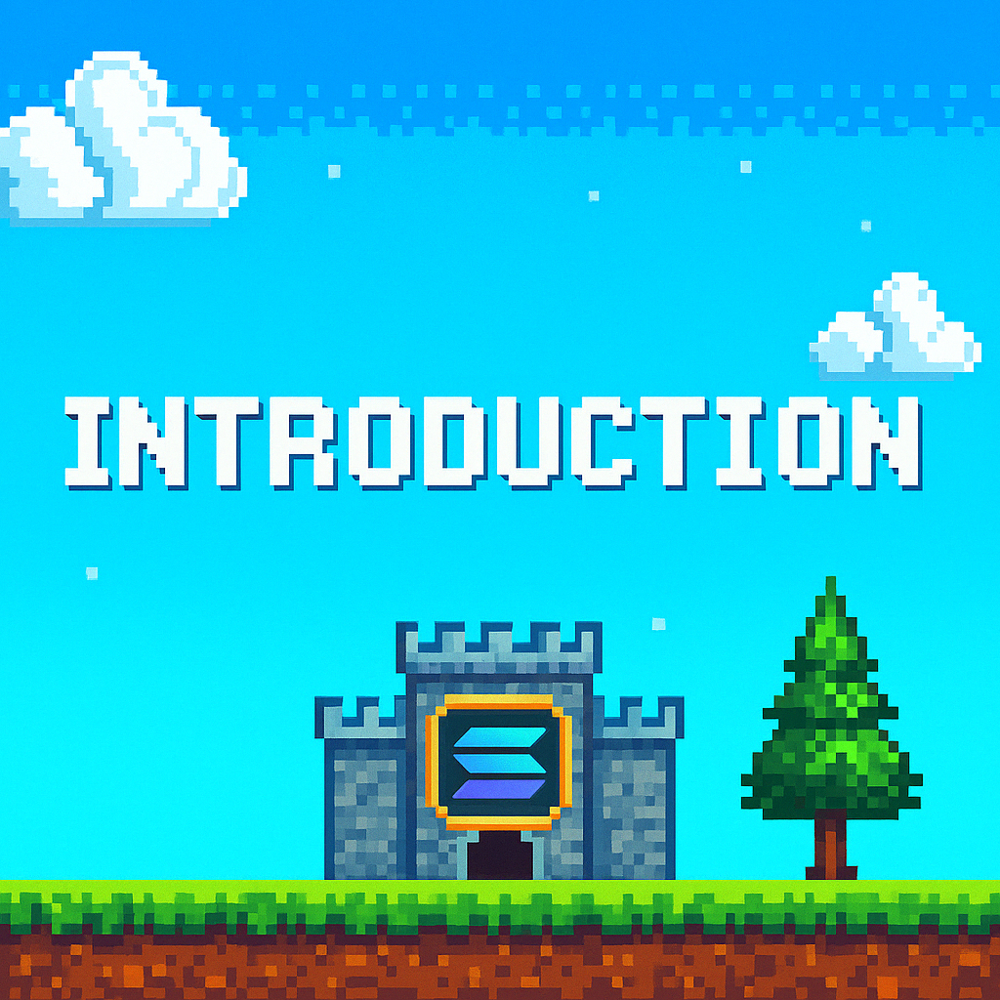

# Introduction

The gaming industry is rapidly evolving with the integration of blockchain technologies. Web3 gaming, also known as GameFi, introduces new economic models that reward users not just with entertainment, but with real, tradable value.

Synaptix leverages the Solana blockchain to deliver high-speed, low-cost, and secure gaming interactions, shifting power from centralized game studios to the players themselves. In this paper, we present our mission, technology stack, and monetization model that together form a sustainable and exciting Play-to-Earn ecosystem.

## Why Solana?
Solana offers lightning-fast transaction speeds (up to 65,000 TPS) and near-zero gas fees, making it the perfect environment for micro-transactions and real-time gameplay interactions.
