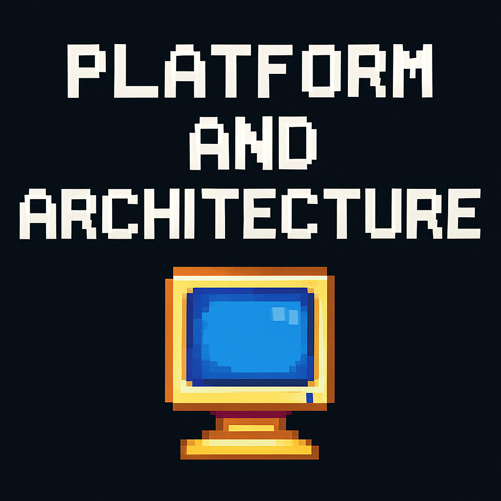

# Platform Architecture

Synaptix is built with scalability, security, and modularity in mind. Below is a breakdown of the key architectural components:

## Core Layers
- **Frontend**: Pixel-art inspired UI built with modern JavaScript frameworks and wallet integrations.
- **Backend**: API gateway that routes player actions, game results, and transaction logs.
- **Smart Contracts**: Deployed on Solana, responsible for reward logic, NFTs, and leaderboard validation.

## Wallets & Auth
- 🔑 Supports Phantom, Backpack, Solflare, and other Solana wallets
- 🔒 Non-custodial, user-first authentication with no centralized login

## Game Engine Support
- Unity & HTML5 mini-games
- Lightweight SDK for indie developers
